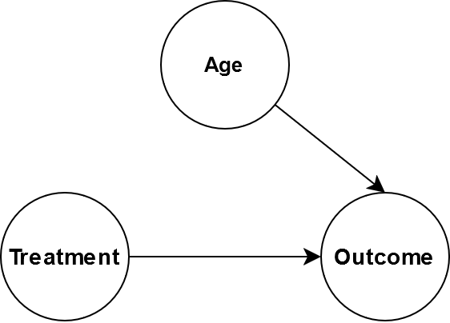

Causality vs Correlation
========================

Intuitively, we all understand cause and effect relationships; rain causes a
wet pavement but a wet pavement does not cause rain. Getting a computer to
understand these relationships is tricky. Current state of the art machine
learning algorithms are very good at exploiting data correlations and applied
to lots of problems very successfully however it does have limitations which we
will introduce in this section.

This article is an introduction to causal inference. I am not an expert in this
topic so this contains some of my own thoughts and questions.

Spurious correlations
---------------------

There is a wealth of humorous correlation examples out in the literature. Tyler
Vigen hosts a website (https://www.tylervigen.com/spurious-correlations)
dedicated to finding highly correlated, completely unrelated data. One such
dataset is shown below. Unless people named Alix are much more likely steal
cars, there is no relation between that and carjackings. Machine learning
algorithms that are trained to exploit spurious correlations have real world
consequences.

.. raw:: html
   :file: Images/spurious_correlation.svg

The IID Assumption
------------------

Modern machine learning relies heavily on the assumption that the training and
test data is independently and identically distributed. The assumption has two
parts:

**Independently Distributed**
    Each data point does not influence the other data points. For example, the
    result of one coin flip does not affect the next.

**Identically Distributed**
   Every data point comes from the same probability distribution.

These assumptions are why we split our datasets into a training and test
dataset. We assume the test data is sampled from the same distribution as the
training data so if a model performs well on the training data, it should also
perform well on the test data. We may in-fact train a good model that performs
well on the unseen test data but when the model is put into production we find
that new data coming does not look like the train/test data, and model
performance degrades.

In the Imagenet challenge, huskies tend to be in snowy backgrounds. Some of the
best performing models seem to base their dog breed predictions at least in
part of the background meaning if the models are presented with a husky in a
desert, there is a good chance it will be misclassified.

How can Causal Inference Help?
------------------------------

Randomized Controlled Trials
----------------------------

Randomized control trials are the gold standard for causal inference. A well
designed study lets causal conclusions be drawn from association by
:cite:`Rawlinson2023`:

1. Making a change to one group but not the other.
2. Making the treated and control groups comparable by eliminating all sources
   of bias through randomisation.

Eliminating all sources of cofounders from the treated and controls means that
any differences observed between the groups must be due the intervention.

.. figure:: Images/randomised_controlled_trial.png
   :width: 500
   :alt: An image showing a control and treated where the confounders are the same.

   This figures shows the treated and control group in a randomised control. The
   same number of blue, orange, and green stick figures are in each group so the
   same cofounders are in both groups.

Randomised controlled trials can be very expensive and sometimes unethical. For
example, suppose we wanted to measure the causal impact of smoking on cancer.
Obviously, it would be immoral to ask a group of random participants to smoke
for the next 25 years to measure the effect on their health. These kinds of
economic and ethical concerns are common, so there is a lot of interest in how
we can measure causal effects from purely observational data.

What are the Problems where you Should Consider Using Causal Inference?
-----------------------------------------------------------------------

You should consider using causal inference if you are trying to answer what-if
questions.

* If I decrease the price of my product, what will be the effect on sales.

There efforts to broaden the scope of causal inference and apply it to more
general prediction problems. One are where causal inference is being used is
for out of distribution prediction.

Causal Graphs
-------------

Causal graphs are a compact way to represent the assumptions we make about our
data. A causal graph must be directed and acyclic.

Nodes are made up of nodes and edges:

* **Nodes** represent variables or features in the world.
* **Edges** represent a causal relationships that connects two nodes no matter
  how strong the connection.

Saying two nodes have no edge connecting is a stronger assumption than saying
they are connected but their connection is very weak :cite:`Kiciman2019`. Below
is a graph for rain and wet ground, the rain causes the ground to become wet
which causes people to slip.

.. image:: Images/rain_to_wet_ground_to_slip.png
   :width: 500
   :alt: Image showing rain causes wet ground which causes slips

Causal Graphs help us reason about our system to ask questions like: if we
intervene to make the ground drier, what is the impact on slips?

Assumptions
-----------

* Suppose we have the graph A -> B -> C. If we change A, that will affect the
  relationship between A and B but not C :cite:`Kiciman2019`.

Structural Equations
--------------------

A causal graph does not say anything about the relationship between nodes, only
that the relationship exists or does not exist. One way to measure the
relationship between nodes is with structural equation models. Consider the
following DAG:

.. image:: Images/toy_graph.png
   :width: 500
   :alt: An example toy graph.

The structural equations for this DAG look like this:

.. math::

   B & \leftarrow f_1(A) \\
   C & \leftarrow f_2(A) \\
   D & \leftarrow f_3(B, C) \\
   E & \leftarrow f_4(D) \\

The functions :math:`f_i` can take on any form but we can limit things further
by enforcing a linear relationships on the functions.

.. math::

   B & \leftarrow \alpha_1 \cdot A \\
   C & \leftarrow \alpha_2 \cdot A \\
   D & \leftarrow \alpha_3 \cdot B + \alpha_4 \cdot C \\
   E & \leftarrow \alpha_5 \cdot D \\

Structural Equations and Linear Regression
------------------------------------------

The equations presented in the previous look very similar to linear regression.
So what is the advantage to creating a graphical causal model? We will
demonstrate the utility through an example.

Suppose we want to measure the effectiveness of a drug from the following DAG
where :code:`T` is the quantity of the drug that is administered, :code:`O` is
the outcome of some biomarker that we want to improve like blood pressure.

.. image:: Images/treatment_cofounder.png
   :width: 400
   :alt: An example toy graph.

Do a Simpson's paradox example.

Pearl's Ladder of Causation
---------------------------

Certain types of structural causal models fall on rung three of Pearl's ladder
of causation.

.. list-table:: Pearl's ladder of causation :cite:`Pearl2009`.
   :header-rows: 1

   * - Level
     - Activity
     - Questions
     - Examples

   * - 1
     - Imagining
     - What if I had done *X* instead of *Y*.
     - Would this image still be classified as a zerbra if it had spikes
       instead of spots?

   * - 2
     - Intervening
     - What if I do *X*?
     - If we ban cigarettes, will smoking reduce?

   * - 3
     - Observing, Association
     - What is important?
     - What is the breed of dog in this image?

Traditional machine learning like image classification, regression, and
clustering fall on the first third run of Peal's causation ladder. Structural
causal models can be used for intervening and imaging type reasoning.

Level 2: Intervention through the Outcome Framework
---------------------------------------------------

Interventions questions are things like:

* What would the effect be on B if I change the value (intervene) on A.

Consider the following causal graph.

.. image:: Images/age_treatment_outcome.png
   :width: 350
   :alt: An example toy graph.

Age affects the treatment and the outcome. Perhaps the treatment dosage has the
be reduced depending on age. Suppose that we wanted to give everybody the same
treatment regardless of age. One might thing our goal is to determine
:math:`P(O|T=t,A)` but that is not quite correct. Our intervention means that
age no longer causes the treatment so the causal graph becomes:

Mathematically, this is written as :math:`P(O|\text{do}(T))` where the operator
:math:`\text{do}(T)` represents the intervention. From this leads nicely onto
the idea of an average treatment effect which is the average effect on the
population from making an intervention.

Suppose the treatment :math:`T` is binary meaning we either apply it
(:math:`1`), or we do not (:math:`0`). In :math:`\text{do}` notation, the definition of average an treatment effect is:

.. math::

   \text{ATE} = \mathbb{E}[Y | \text{do} (T = 1)] - \mathbb{E}[Y | \text{do} (T = 0)] 

.. bibliography::
